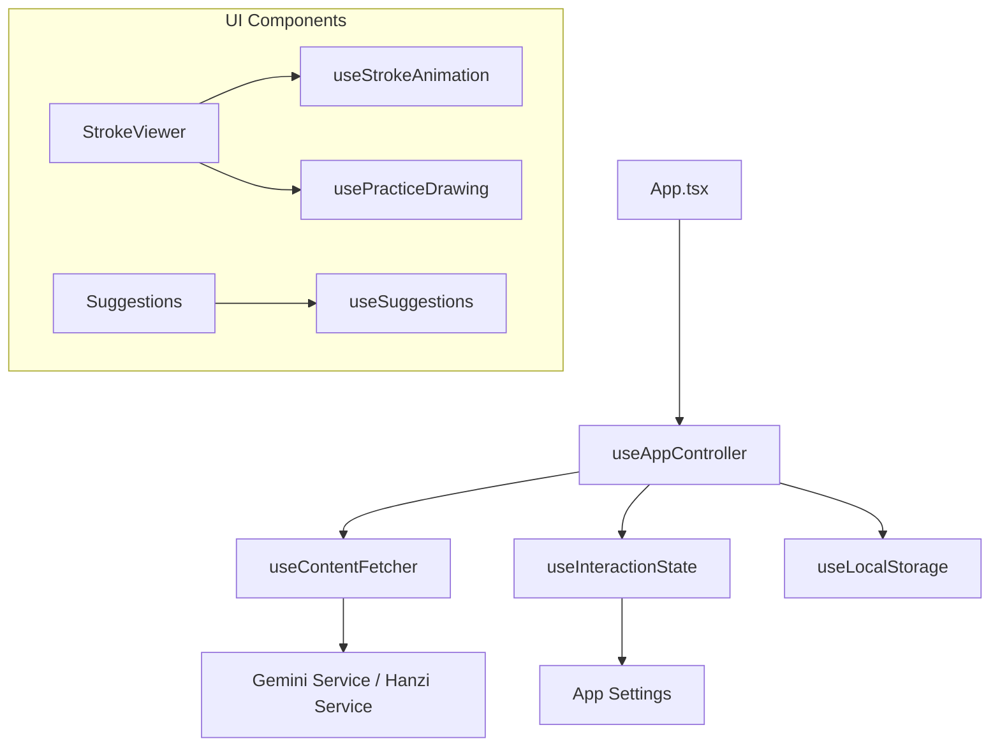

# 02. 技术架构规范

## 1. 设计哲学
*   **数据驱动**: 所有的 UI 状态（笔顺进度、解析内容）均由状态机统一管理。
*   **防御式设计**: 针对网络波动设计多级 Fallback 机制。
*   **关注点分离**: UI 组件只负责渲染，逻辑处理下沉至自定义 Hooks。

## 2. 状态管理架构 (State Management)

项目采用 **组合式 Hooks (Composable Hooks)** 模式，以 `useAppController` 为核心协调器：

*   **useAppController**: 全局单例 Hook，管理路由状态（URL Search Params）、历史记录、主题及核心数据的流转。
*   **useContentFetcher**: 专门负责数据的获取、加载状态管理 (Loading/Error) 及 L2 缓存 (LocalStorage) 的读写。
*   **useInteractionState**: 管理当前是“演示模式”还是“练习模式”，以及播放速度、暂停/播放状态。

## 3. 核心管线 (Core Pipelines)

### 3.1 笔画渲染与校验管线
1.  **数据解析**: 将 `HanziData` 中的 `strokes` 转换为 SVG 遮罩。
2.  **动画驱动**: 使用 `useStrokeAnimation` 内部的 `requestAnimationFrame` 循环，配合 CSS `stroke-dasharray` 实现平滑流动。
3.  **几何校验**: 
    *   由 `usePracticeDrawing` 监听 Canvas 的 `PointerEvent`。
    *   实时计算手写轨迹与 `medians` 路径的欧几里得距离。
    *   判定逻辑：起止点重合度 > 85% 且 路径偏差 < 阈值，判定为通过。

### 3.2 AI 响应管线
*   **并行请求**: 发起解析请求时，同时触发文本生成与 TTS 生成。
*   **上下文管理**: 维护最近 10 次查询的上下文，提高 AI 回复的相关性。
*   **异常处理**: 捕获 429 (频率限制) 和 5xx 错误，触发本地 `OfflineAnalysis` 生成器。

### 3.3 图像生成管线 (Image Generation)
*   **纯前端生成**: 使用 HTML5 Canvas API，无需后端服务。
*   **矢量转位图**: 解析 SVG 路径数据 (`HanziData.strokes`)，在 Canvas 上重绘为高分辨率位图。
*   **字体加载**: 监听 `document.fonts.ready` 事件，确保拼音和品牌文字渲染时字体已加载，避免乱码。
*   **主题适配**: 自动读取当前 DOM 的 `dark` class，生成对应配色（深色/浅色）的图片。

## 4. 存储与数据分层策略
*   **L1: 内存 (Memory)**: 运行时状态，音频 Buffer 缓存。
*   **L2: 本地缓存 (LocalStorage)**: 
    *   `appSettings`: 用户偏好。
    *   `practiceHistory`: 最近 50 条练习记录。
    *   `ai_pinyin_cache`: AI 动态补全的生僻字拼音映射表。
    *   `ai_analysis_cache`: 单字解析 L2 缓存。
    *   `ai_idiom_cache`: 成语解析 L2 缓存。
*   **L3: 静态资源 (Static/SW)**: `public/hanzi-data/` 下的 9000+ JSON 文件，通过构建脚本自动化生成，由 Service Worker 预缓存。

## 5. 混合语音架构 (Hybrid TTS)
为了平衡音质与可用性，系统采用以下优先级策略：
1.  **Cache Hit**: 优先检查内存中是否已有该文本的 `AudioBuffer`。
2.  **Gemini TTS**: 若在线且有 Key，请求 `gemini-2.5-flash-preview-tts` 获取高保真 PCM 音频流。
3.  **Native Fallback**: 若 API 失败、配额超限或离线，瞬间无缝切换至浏览器原生 `window.speechSynthesis`。

## 6. 安全性与隐私
*   **API Key 安全**: 支持用户在客户端设置自己的 API Key，不经过任何中转服务器。
*   **内容审查**: 开启 Gemini 的安全过滤设置，确保解释内容符合教育用途。

## 7. 构建与依赖管理 (Build & Deployment)
为确保生产环境的稳定性及 PWA 的离线可用性，必须严格遵守以下构建规范：

*   **模块管理**: 所有核心依赖版本需在 `index.html` 的 `<importmap>` 中明确声明，确保开发与生产环境版本一致。
*   **CSP 策略**: 
    *   `script-src`: 'self' 'unsafe-inline' https://esm.sh;
    *   `connect-src`: 'self' https://generativelanguage.googleapis.com https://cdn.jsdelivr.net;

---
*文档维护: HanziMaster Architecture Team*
