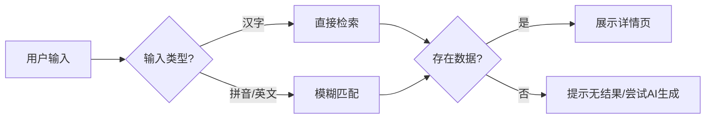
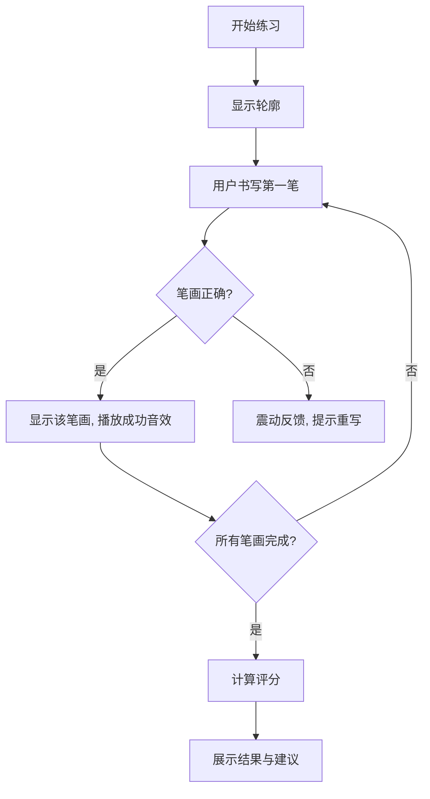

# 04. 功能模块说明 (Functional Modules)

**项目**: HanziMaster (汉字大师)
**版本**: v1.4.0
**状态**: 现行规范

## 1. 模块概览 (Overview)

HanziMaster 的核心功能围绕“视、听、写”三大教学环节展开，分为以下五个主要模块：

1.  **汉字检索与展示模块 (Search & Display Module)**
2.  **笔顺动画演示模块 (Stroke Animation Module)**
3.  **交互式书写练习模块 (Interactive Practice Module)**
4.  **AI 辅助教学模块 (AI Assistant Module)**
5.  **用户进度与设置模块 (User Progress & Settings Module)**

## 2. 汉字检索与展示模块 (Search & Display Module)

### 2.1 核心功能
*   **多模式搜索**: 支持汉字、拼音、英语释义搜索。
*   **智能联想**: 输入拼音或部分笔画时提供候选字。
*   **详情展示**: 大字展示，支持田字格/米字格背景切换。

### 2.2 关键逻辑
*   **搜索算法**:
    1.  优先匹配汉字本身。
    2.  其次匹配拼音（支持声调和无声调）。
    3.  最后匹配英文释义。
*   **数据获取**:
    *   优先从 `hanzi-writer-data` 获取 SVG 数据。
    *   若本地无数据，尝试从 CDN 加载。
    *   若 CDN 无数据，尝试调用 AI 生成（实验性）。

### 2.3 业务流程图

## 3. 笔顺动画演示模块 (Stroke Animation Module)

### 3.1 核心功能
*   **自动播放**: 按标准笔顺自动书写。
*   **步进控制**: 上一步/下一步，暂停/继续。
*   **速度调节**: 支持 0.5x, 0.75x, 1.0x, 1.5x 播放速度。
*   **笔画拆解**: 高亮当前笔画，淡化其他笔画。

### 3.2 关键逻辑
*   **动画引擎**: 基于 `hanzi-writer` 库。
*   **状态管理**: 使用 `useAnimationState` Hook 管理播放状态 (Playing, Paused, Idle)。
*   **SVG 渲染**: 动态生成 SVG 路径，通过 CSS `stroke-dasharray` 实现书写效果。

## 4. 交互式书写练习模块 (Interactive Practice Module)

### 4.1 核心功能
*   **临摹模式**: 在半透明轮廓引导下书写。
*   **自由书写**: 无辅助线书写，系统自动识别笔画。
*   **实时反馈**: 正确笔画变色，错误笔画震动提示。
*   **智能评分**: 练习结束后给出 0-100 分。

### 4.2 关键逻辑
*   **笔画识别**:
    *   采集用户书写轨迹坐标 `(x, y, t)`。
    *   与标准笔画 SVG 路径进行比对 (Hausdorff 距离算法)。
    *   容错阈值：允许 10-20px 的偏差。
*   **评分算法**:
    *   `Accuracy` (准确度): 形状相似度 (权重 60%)。
    *   `Stroke Order` (笔顺): 顺序正确性 (权重 40%)。
    *   若笔顺错误，直接扣除 40 分。

### 4.3 业务流程图

## 5. AI 辅助教学模块 (AI Assistant Module)

### 5.1 核心功能
*   **字源解析**: 生成汉字的象形演变故事。
*   **记忆口诀**: 生成结构化助记口诀。
*   **智能组词**: 根据用户水平生成常用词组。
*   **发音朗读**: 提供标准普通话 TTS。

### 5.2 关键逻辑
*   **Prompt Engineering**: 使用结构化 Prompt 引导 Gemini 生成 JSON 格式数据。
*   **缓存策略**: AI 生成的内容缓存至 `LocalStorage`，避免重复调用 API。
*   **降级策略**: 若 AI 服务不可用，仅展示基础字典释义。

## 6. 用户进度与设置模块 (User Progress & Settings Module)

### 6.1 核心功能
*   **历史记录**: 自动记录最近查询和练习的汉字。
*   **生词本**: 用户手动收藏的汉字。
*   **设置**: 切换语言、主题 (Light/Dark)、离线模式开关。

### 6.2 关键逻辑
*   **数据持久化**: 使用 `LocalStorage` 存储用户数据。
*   **同步机制**: (未来) 支持云端同步。

---
*文档维护: HanziMaster Product Team*
