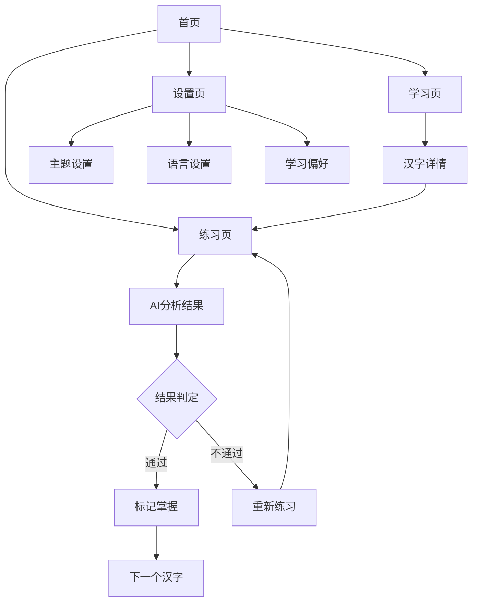

# HanziMaster 汉字大师 UI原型图
=====================================

## 1. 原型图概述

本文档展示 HanziMaster 汉字大师的UI原型图设计，包括页面布局、组件位置、交互流程和响应式适配策略。

## 2. 设计原则

### 2.1 布局原则
- **一致性**: 所有页面遵循统一的设计语言
- **层次感**: 通过色彩、大小、间距建立视觉层次
- **简洁性**: 减少视觉噪音，突出核心内容
- **响应式**: 优先桌面设计，移动端适配

### 2.2 间距系统

```css
/* 基础间距单位 */
--spacing-unit: 4px;

/* 间距规范 */
--spacing-xs: 4px;    /* 0.25rem */
--spacing-sm: 8px;    /* 0.5rem */
--spacing-md: 16px;   /* 1rem */
--spacing-lg: 24px;   /* 1.5rem */
--spacing-xl: 32px;   /* 2rem */
--spacing-2xl: 48px;  /* 3rem */
--spacing-3xl: 64px;  /* 4rem */
```

### 2.3 颜色应用规范

| 场景 | 浅色模式 | 深色模式 | 说明 |
|------|---------|---------|------|
| 主要操作 | bg-emerald-600 | bg-emerald-500 | CTA按钮 |
| 次要操作 | bg-slate-100 | bg-slate-700 | 次要按钮 |
| 成功状态 | bg-emerald-100 | bg-emerald-900 | 正确反馈 |
| 错误状态 | bg-red-100 | bg-red-900 | 错误提示 |
| 警告状态 | bg-amber-100 | bg-amber-900 | 警告提示 |

## 3. 首页原型图

### 3.1 首页布局结构

```
┌─────────────────────────────────────────────────────────────────┐
│ [Logo] HanziMaster          学习  练习   [🌐 EN ▼] [☀️/🌙] [登录] │  ← Header (64px)
├─────────────────────────────────────────────────────────────────┤
│                                                                   │
│  ┌─────────────────────────────┐   ┌─────────────────────────┐ │
│  │                             │   │    ┌─────────────────┐  │ │
│  │   探索汉字之美               │   │    │     永          │  │ │
│  │   AI 驱动的汉字学习平台      │   │    │   (旋转卡片)    │  │ │
│  │                             │   │    │   Forever       │  │ │
│  │   [🚀 开始学习]  [📚 探索]   │   │    └─────────────────┘  │ │
│  │                             │   │                         │ │
│  └─────────────────────────────┘   │   笔画数: 5            │ │
│                                    │   ████████░░ 60%       │ │
│                                    │   "永"字取..."         │ │
│                                    └─────────────────────────┘ │
│                                                                   │
├─────────────────────────────────────────────────────────────────┤
│                                                                   │
│  ┌─────────────────┐  ┌─────────────────┐  ┌─────────────────┐   │
│  │ 💡 AI洞察      │  │ 📖 词源文化     │  │ 📊 自适应学习   │   │
│  │                 │  │                 │  │                 │   │
│  │ 智能反馈您的    │  │ 探索汉字背后    │  │ 根据您的进度    │   │
│  │ 笔画顺序和      │  │ 的历史故事     │  │ 定制学习路径    │   │
│  │ 书写美感        │  │ 和文化背景      │  │                 │   │
│  └─────────────────┘  └─────────────────┘  └─────────────────┘   │
│                                                                   │
├─────────────────────────────────────────────────────────────────┤
│                     © 2026 HanziMaster 汉字大师                   │  ← Footer
└─────────────────────────────────────────────────────────────────┘
```

### 3.2 首页组件规格

#### Header组件
- **高度**: 64px
- **背景**: bg-white dark:bg-slate-800
- **边框**: border-b border-slate-200 dark:border-slate-700
- **Logo**: 翡翠绿 #059669，字号32px
- **导航链接**: 字号14px，hover颜色 emerald-600

#### Hero区域
- **布局**: CSS Grid，双列 (lg:grid-cols-2)
- **左列宽度**: 最大宽度50%
- **右列**: 卡片旋转角度 -2deg，hover时0deg
- **间距**: gap-12 (48px)

#### 展示卡片
- **背景**: bg-white dark:bg-slate-800
- **圆角**: rounded-[3rem] (48px)
- **阴影**: shadow-2xl
- **内边距**: p-8 (32px)
- **边框**: border border-slate-100 dark:border-slate-700

#### 特性卡片
- **布局**: 三列网格 (md:grid-cols-3)
- **间距**: gap-8 (32px)
- **高度**: 统一高度，垂直居中
- **圆角**: rounded-3xl (24px)
- **阴影**: shadow-sm hover:shadow-md

### 3.3 首页交互规范

| 交互 | 元素 | 行为 | 动画 |
|------|------|------|------|
| 导航hover | 导航链接 | 颜色变为emerald-600 | transition-colors 200ms |
| 按钮hover | 主按钮 | 背景变深，轻微放大 | scale(1.05), bg-emerald-700 |
| 卡片hover | 展示卡片 | 旋转角度变为0 | transform rotate 500ms |
| 卡片hover | 特性卡片 | 阴影增强，轻微放大 | scale(1.02), shadow-md |

## 4. 学习页原型图

### 4.1 学习页布局结构

```
┌─────────────────────────────────────────────────────────────────┐
│ [Logo] HanziMaster          学习  练习   [🌐 EN ▼] [☀️/🌙] [登录] │  ← Header
├─────────────────────────────────────────────────────────────────┤
│                                                                   │
│  ┌─────────────────────────────────────────────────────────────┐ │
│  │  🔍 搜索汉字或拼音...                          [筛选 ▼]      │ │  ← 工具栏
│  └─────────────────────────────────────────────────────────────┘ │
│                                                                   │
│  ┌──────────────────────────────────────────────────────────────┐│
│  │                                                              ││
│  │   ┌─────┐  ┌─────┐  ┌─────┐  ┌─────┐  ┌─────┐  ┌─────┐     ││
│  │   │  一  │  │  二  │  │  三  │  │  人  │  │  大  │  │  小  │     ││  ← 汉字网格
│  │   │ yī  │  │ èr  │  │ sān  │  │ rén │  │ dà  │  │ xiǎo│     ││
│  │   │ 1画 │  │ 2画 │  │ 3画 │  │ 2画 │  │ 3画 │  │ 3画 │     ││
│  │   └─────┘  └─────┘  └─────┘  └─────┘  └─────┘  └─────┘     ││
│  │                                                              ││
│  │   ┌─────┐  ┌─────┐  ┌─────┐  ┌─────┐  ┌─────┐  ┌─────┐     ││
│  │   │  中  │  │  国  │  │  永  │  │  和  │  │  平  │  │  安  │     ││
│  │   │ zhōng│  │ guó │  │ yǒng │  │ hé  │  │ píng │  │ ān  │     ││
│  │   │ 4画 │  │ 8画 │  │ 5画 │  │ 8画 │  │ 5画 │  │ 6画 │     ││
│  │   └─────┘  └─────┘  └─────┘  └─────┘  └─────┘  └─────┘     ││
│  │                                                              ││
│  └──────────────────────────────────────────────────────────────┘│
│                                                                   │
│  ┌─────────────────────────────────────────────────────────────┐  │
│  │                      < 1 / 10 >                            │  │  ← 分页
│  └─────────────────────────────────────────────────────────────┘  │
│                                                                   │
├─────────────────────────────────────────────────────────────────┤
│                                                                   │
│  ┌─────────────────────────────────────────────────────────────┐  │
│  │  学习进度总览                                              │  │
│  │  ████████████████████░░░░░░░░░░░░░░░░ 40%               │  │
│  │  已学习: 120 / 总汉字: 300                                  │  │
│  └─────────────────────────────────────────────────────────────┘  │
│                                                                   │
└─────────────────────────────────────────────────────────────────┘
```

### 4.2 学习页组件规格

#### 工具栏
- **背景**: bg-white dark:bg-slate-800
- **高度**: 56px
- **圆角**: rounded-xl
- **搜索框**: flex-1, pl-10 (留出搜索图标位置)
- **筛选按钮**: ml-4, w-auto

#### 汉字卡片
- **尺寸**: 120px × 140px
- **背景**: bg-white dark:bg-slate-800
- **圆角**: rounded-2xl
- **汉字字号**: 48px (hanzi-font)
- **拼音字号**: 14px
- **笔画信息**: 12px, text-slate-400
- **边框**: border border-slate-100 dark:border-slate-700
- **间距**: gap-4 (16px)

#### 进度条
- **高度**: 8px
- **背景**: bg-slate-100 dark:bg-slate-700
- **填充**: bg-emerald-500
- **圆角**: rounded-full

### 4.3 汉字详情面板

```
┌─────────────────────────────────────────┐
│                                          │
│              ✕ 关闭                      │
│                                          │
│              ┌───────────┐               │
│              │           │               │
│              │    永     │               │  ← 大字展示 (144px)
│              │           │               │
│              └───────────┘               │
│                                          │
│          yǒng • Forever                  │
│                                          │
│  ┌────────────────────────────────────┐ │
│  │ 笔画数: 5  │ 部首: 丶  │ 结构: 独体 │ │
│  └────────────────────────────────────┘ │
│                                          │
│  ┌────────────────────────────────────┐ │
│  │ 笔画顺序                           │ │
│  │ 1. 点  2. 横折  3. 横  4. 撇  5. 捺│ │
│  │                                    │ │
│  │ [显示动画]  [显示静态]              │ │
│  └────────────────────────────────────┘ │
│                                          │
│  ┌────────────────────────────────────┐ │
│  │ 词源故事                           │ │
│  │                                    │ │
│  │ "永"字取自..."                     │ │
│  │                                    │ │
│  └────────────────────────────────────┘ │
│                                          │
│  ┌────────────────────────────────────┐ │
│  │ 💡 AI洞察                         │ │
│  │                                    │ │
│  │ [开始练习]                         │ │
│  └────────────────────────────────────┘ │
│                                          │
└─────────────────────────────────────────┘
```

## 5. 练习页原型图

### 5.1 练习页布局结构

```
┌─────────────────────────────────────────────────────────────────┐
│ [Logo] HanziMaster          学习  练习   [🌐 EN ▼] [☀️/🌙] [登录] │
├─────────────────────────────────────────────────────────────────┤
│                                                                   │
│  ┌───────────────────────────────────┐  ┌─────────────────────┐  │
│  │                                   │  │                     │  │
│  │   ┌─────────────────────────┐   │  │   📊 AI分析结果     │  │
│  │   │                         │   │  │                     │  │
│  │   │                         │   │  │   总分: 85/100      │  │
│  │   │        永              │   │  │   ████████░░        │  │
│  │   │      (目标字)          │   │  │                     │  │
│  │   │                         │   │  │   笔画顺序: 80/100  │  │
│  │   └─────────────────────────┘   │  │   ████████░░        │  │
│  │                                   │  │                     │  │
│  │   ┌─────────────────────────┐   │  │   平衡性: 90/100    │  │
│  │   │                         │   │  │   █████████░        │  │
│  │   │                         │   │  │                     │  │
│  │   │      (书写区域)        │   │  │   美学评估: 85/100  │  │
│  │   │                         │   │  │   ████████░░        │  │
│  │   │                         │   │  │                     │  │
│  │   │                         │   │  │   ─────────────────  │  │
│  │   └─────────────────────────┘   │  │                     │  │
│  │                                   │  │   💡 建议           │  │
│  │   笔画数: 0/5                    │  │   您的第三笔横折... │  │
│  │   ░░░░░░░░░░░░░░░░░░░          │  │                     │  │
│  │                                   │  │                     │  │
│  └───────────────────────────────────┘  └─────────────────────┘  │
│                                                                   │
│  ┌─────────────────────────────────────────────────────────────┐ │
│  │     [↺ 重置]        [✓ 提交分析]        [→ 下一个]          │ │
│  └─────────────────────────────────────────────────────────────┘ │
│                                                                   │
└─────────────────────────────────────────────────────────────────┘
```

### 5.2 练习页组件规格

#### Canvas区域
- **宽度**: 400px (桌面) / 300px (移动)
- **高度**: 400px (桌面) / 300px (移动)
- **背景**: bg-slate-50 dark:bg-slate-900
- **边框**: 2px dashed border-slate-200 dark:border-slate-600
- **圆角**: rounded-2xl
- **目标字**: 绝对定位，z-index: -1, 透明度20%

#### 反馈面板
- **宽度**: 320px (桌面) / 全宽 (移动)
- **背景**: bg-white dark:bg-slate-800
- **圆角**: rounded-2xl
- **阴影**: shadow-md
- **内边距**: p-6

#### 评分条
- **高度**: 12px
- **背景**: bg-slate-100 dark:bg-slate-700
- **填充渐变**: from-emerald-400 to-emerald-600
- **圆角**: rounded-full
- **动画**: 进度条填充动画 500ms ease-out

### 5.3 练习页交互流程

```
开始练习 → 用户书写 → 实时笔画计数
    ↓
提交分析 → AI处理 → 显示反馈
    ↓
查看结果 → 
    ├─ 合格 → 标记已掌握 → 继续下一个
    └─ 不合格 → 查看错误 → 重写 → 重新提交
```

## 6. 设置页原型图

### 6.1 设置页布局结构

```
┌─────────────────────────────────────────────────────────────────┐
│ [Logo] HanziMaster          学习  练习   [🌐 EN ▼] [☀️/🌙] [登录] │
├─────────────────────────────────────────────────────────────────┤
│                                                                   │
│  ┌─────────────────────────────────────────────────────────────┐ │
│  │                    ⚙️ 设置                                   │ │
│  └─────────────────────────────────────────────────────────────┘ │
│                                                                   │
│  ┌─────────────────────────────────────────────────────────────┐ │
│  │                                                             │ │
│  │  ┌───────────────────────────────────────────────────────┐  │ │
│  │  │ 🎨 主题设置                                          │  │ │
│  │  │                                                       │  │ │
│  │  │ 当前主题: [浅色] [深色] [跟随系统]                     │  │ │
│  │  │                                                       │  │ │
│  │  └───────────────────────────────────────────────────────┘  │ │
│  │                                                             │ │
│  │  ┌───────────────────────────────────────────────────────┐  │ │
│  │  │ 🌐 语言设置                                           │  │ │
│  │  │                                                       │  │ │
│  │  │ 界面语言: [English ▼]                                │  │ │
│  │  │                                                       │  │ │
│  │  │ 支持的语言:                                           │  │ │
│  │  │ • English  • 简体中文  • 繁體中文                      │  │ │
│  │  │ • Español  • العربية  • Français                     │  │ │
│  │  │ • Português • Deutsch  • 日本語                      │  │ │
│  │  │ • 한국어    • Русский                                │  │ │
│  │  │                                                       │  │ │
│  │  └───────────────────────────────────────────────────────┘  │ │
│  │                                                             │ │
│  │  ┌───────────────────────────────────────────────────────┐  │ │
│  │  │ 📊 学习偏好                                           │  │ │
│  │  │                                                       │  │ │
│  │  │ 每日目标: [5] 个汉字                                   │  │ │
│  │  │                                                       │  │ │
│  │  │ 难度偏好: ○ 简单  ● 中等  ○ 困难                      │  │ │
│  │  │                                                       │  │ │
│  │  │ ☑️ 显示词源故事                                       │  │ │
│  │  │ ☑️ 开启声音反馈                                       │  │ │
│  │  │ ☐ 显示详细分析                                        │  │ │
│  │  │                                                       │  │ │
│  │  └───────────────────────────────────────────────────────┘  │ │
│  │                                                             │ │
│  │  ┌───────────────────────────────────────────────────────┐  │ │
│  │  │ 💾 数据管理                                           │  │ │
│  │  │                                                       │  │ │
│  │  │ 学习进度: ████████████████████ 100KB                  │  │ │
│  │  │                                                       │  │ │
│  │  │  [导出数据]    [清除进度]                             │  │ │
│  │  │                                                       │  │ │
│  │  └───────────────────────────────────────────────────────┘  │ │
│  │                                                             │ │
│  └─────────────────────────────────────────────────────────────┘ │
│                                                                   │
└─────────────────────────────────────────────────────────────────┘
```

## 7. 响应式设计原型

### 7.1 移动端布局 (320px - 767px)

#### 首页移动端
```
┌─────────────────────┐
│ [Logo]  [菜单]      │  ← 汉堡菜单
├─────────────────────┤
│                     │
│   探索汉字之美       │
│   AI 驱动的汉字学习平台│
│                     │
│   [🚀 开始学习]      │
│   [📚 探索]         │
│                     │
│   ┌───────────────┐ │
│   │     永        │ │
│   │   (卡片)      │ │
│   └───────────────┘ │
│                     │
│  ┌───────────────┐  │
│  │ 💡 AI洞察     │  │
│  └───────────────┘  │
│  ┌───────────────┐  │
│  │ 📖 词源文化   │  │
│  └───────────────┘  │
│  ┌───────────────┐  │
│  │ 📊 自适应学习 │  │
│  └───────────────┘  │
│                     │
└─────────────────────┘
```

#### 学习页移动端
```
┌─────────────────────┐
│ [Logo]  [菜单]      │
├─────────────────────┤
│ [🔍 搜索...]        │
├─────────────────────┤
│ ┌─────┐ ┌─────┐    │
│ │  一  │ │  二  │    │
│ │ yī  │ │ èr  │    │
│ └─────┘ └─────┘    │
│ ┌─────┐ ┌─────┐    │
│ │  三  │ │  人  │    │
│ │ sān │ │ rén │    │
│ └─────┘ └─────┘    │
│ ┌─────┐ ┌─────┐    │
│ │  大  │ │  小  │    │
│ │ dà  │ │xiǎo │    │
│ └─────┘ └─────┘    │
├─────────────────────┤
│ ◀ 1 / 10 ▶         │
└─────────────────────┘
```

### 7.2 平板布局 (768px - 1023px)

#### 首页平板端
- Hero区域保持双列
- 特性卡片变为双列 (2列网格)
- 展示卡片尺寸缩小20%

#### 练习页平板端
```
┌─────────────────────────────────────────────────────┐
│                                                     │
│  ┌─────────────────────┐  ┌───────────────────────┐ │
│  │                     │  │                       │ │
│  │   ┌─────────────┐   │  │   📊 AI分析结果       │ │
│  │   │             │   │  │                       │ │
│  │   │      永     │   │  │   总分: 85/100         │ │
│  │   │             │   │  │   ████████░░          │ │
│  │   └─────────────┘   │  │                       │ │
│  │                     │  │   笔画顺序: 80/100     │ │
│  │   ┌─────────────┐   │  │                       │ │
│  │   │             │   │  │   平衡性: 90/100       │ │
│  │   │  (书写区)   │   │  │                       │ │
│  │   │             │   │  │   美学评估: 85/100     │ │
│  │   │             │   │  │                       │ │
│  │   └─────────────┘   │  │                       │ │
│  │                     │  │                       │ │
│  └─────────────────────┘  └───────────────────────┘ │
│                                                     │
│  ┌─────────────────────────────────────────────────┐ │
│  │    [↺ 重置]    [✓ 提交分析]    [→ 下一个]       │ │
│  └─────────────────────────────────────────────────┘ │
│                                                     │
└─────────────────────────────────────────────────────┘
```

## 8. 组件状态设计

### 8.1 按钮状态

| 状态 | 样式变化 | 过渡时间 |
|------|---------|---------|
| Default | 正常显示 | - |
| Hover | 背景变深，轻微放大 | 200ms |
| Active | 轻微缩小 | 100ms |
| Disabled | 透明度50%，cursor: not-allowed | - |
| Loading | 显示spinner，禁止点击 | - |

### 8.2 输入框状态

| 状态 | 边框颜色 | 背景色 | 阴影 |
|------|---------|--------|------|
| Default | border-slate-200 | bg-white | none |
| Focus | border-emerald-500 | bg-white | shadow-md |
| Error | border-red-500 | bg-red-50 | none |
| Disabled | border-slate-100 | bg-slate-50 | none |

### 8.3 卡片交互状态

| 状态 | 变换 | 动画 |
|------|------|------|
| Default | 无变换 | - |
| Hover | scale(1.02), shadow-md | 300ms ease |
| Active | scale(0.98) | 100ms |
| Selected | 边框变为主色调 | 200ms |

### 8.4 加载状态

| 组件 | 加载样式 | 动画 |
|------|---------|------|
| 页面加载 | 骨架屏 | 渐变动画 |
| 按钮加载 | spinner + 文字变淡 | 旋转动画 |
| 卡片加载 | 骨架屏占位 | 渐变动画 |
| 列表加载 | 骨架项 | 渐变动画 |

## 9. 导航流程图



## 10. 错误处理界面

### 10.1 空状态

```
┌─────────────────────────────────────────────────────────────┐
│                                                             │
│                    🔍 暂无搜索结果                           │
│                                                             │
│              我们没有找到匹配的汉字                          │
│                                                             │
│              尝试:                                          │
│              • 检查拼写是否正确                              │
│              • 使用不同的关键词搜索                          │
│              • 浏览全部汉字                                  │
│                                                             │
│              [清除搜索]    [浏览全部]                        │
│                                                             │
└─────────────────────────────────────────────────────────────┘
```

### 10.2 错误状态

```
┌─────────────────────────────────────────────────────────────┐
│                                                             │
│                    ⚠️ 网络连接失败                           │
│                                                             │
│              无法连接到服务器，请检查网络连接                 │
│                                                             │
│              [重新尝试]                                      │
│                                                             │
└─────────────────────────────────────────────────────────────┘
```

### 10.3 AI服务错误

```
┌─────────────────────────────────────────────────────────────┐
│                                                             │
│                    🤖 AI服务暂时不可用                       │
│                                                             │
│              AI分析功能暂时无法使用                          │
│              您可以继续手动练习                              │
│                                                             │
│              [继续练习]    [返回首页]                        │
│                                                             │
└─────────────────────────────────────────────────────────────┘
```

## 11. 文档版本

| 版本 | 日期 | 更新内容 |
|------|------|---------|
| v1.1 | 2026-05-31 | 更新至v2.2.1版本 |
| v1.0 | 2026-05-31 | 初始版本，包含首页、学习页、练习页、设置页原型 |

---

**文档版本**: v1.1
**最后更新**: 2026-05-31
**维护者**: HanziMaster Team
