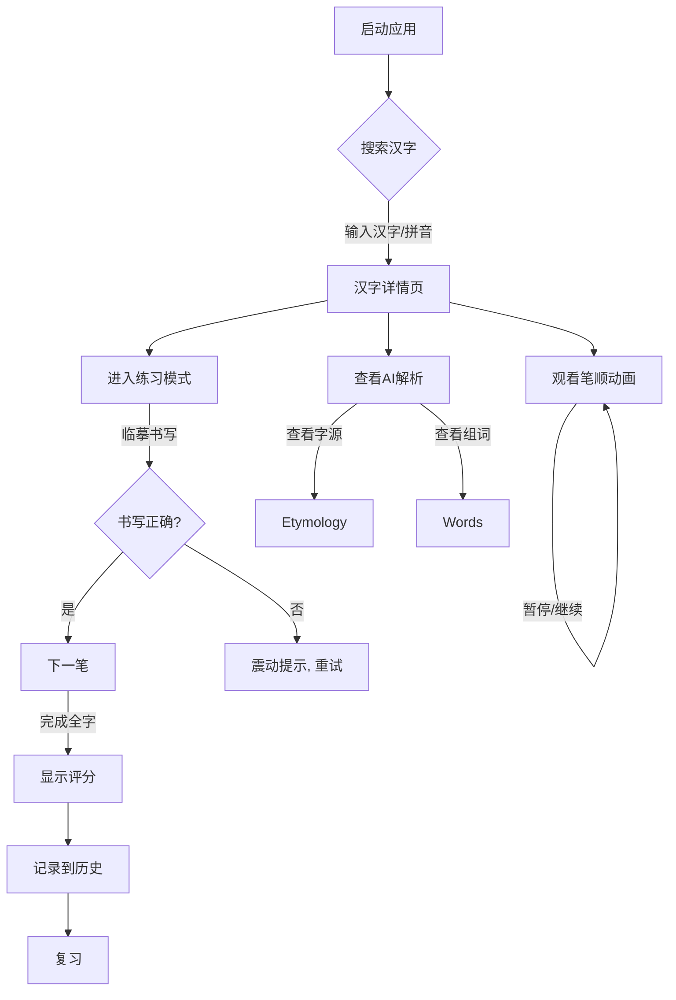

# 08. 用户操作指南 (User Manual)

**项目**: HanziMaster (汉字大师)
**版本**: v1.4.0
**状态**: 现行规范

## 1. 角色与权限 (Roles & Permissions)

HanziMaster 目前主要面向单一用户角色：**学习者 (Learner)**。

*   **学习者**: 可以使用所有核心功能，包括搜索、观看动画、练习书写、查看历史记录和设置偏好。无需注册登录，数据存储在本地浏览器。

## 2. 操作流程图 (User Flow)

## 3. 详细操作步骤 (Step-by-Step Guide)

### 3.1 搜索汉字 (Search)
1.  在首页顶部的搜索框中输入单个汉字（如“爱”）。
2.  也可以输入拼音（如“ai”）或英文释义（如“love”），系统会自动联想。
3.  点击搜索按钮或按回车键，进入汉字详情页。

### 3.2 观看笔顺动画 (Watch Mode)
1.  进入详情页后，默认处于 **Watch** 模式。
2.  点击屏幕中央的 **播放 (Play)** 按钮，开始播放笔顺动画。
3.  点击 **暂停 (Pause)** 按钮可暂停播放。
4.  点击 **重置 (Reset)** 按钮可清除笔迹，重新开始。
5.  点击 **速度 (Speed)** 按钮 (1.0x)，可在 0.5x (慢速) 到 1.5x (快速) 之间切换。

### 3.3 练习书写 (Practice Mode)
1.  在详情页点击 **练习 (Practice)** 按钮（毛笔图标），切换到练习模式。
2.  屏幕上会出现灰色的汉字轮廓。
3.  用手指或触控笔，沿着轮廓书写第一笔。
    *   **正确**: 笔画会变色并吸附，播放成功音效。
    *   **错误**: 笔画会震动并变红，提示重写。
4.  依次完成所有笔画。
5.  完成后，系统会弹出评分面板，显示准确度、笔顺正确率和综合得分。

### 3.4 查看 AI 解析 (AI Analysis)
1.  在详情页向下滚动，可以看到 **AI 助教** 面板。
2.  **字源**: 查看汉字的象形演变图和解释。
3.  **记忆**: 阅读 AI 生成的趣味记忆口诀。
4.  **组词**: 查看常用词组和例句。
5.  点击 **朗读** 图标，可以听取标准发音。

### 3.5 管理历史记录 (History)
1.  在首页向下滚动，可以看到 **最近学习 (History)** 列表。
2.  点击任意汉字可再次进入学习。
3.  点击 **清除 (Clear)** 按钮可清空所有历史记录。

### 3.6 设置 (Settings)
1.  点击页面右上角的 **设置 (Settings)** 图标。
2.  **语言**: 切换界面语言 (English / 中文 / Español 等)。
3.  **主题**: 切换明亮 (Light) / 暗黑 (Dark) 模式。
4.  **离线模式**: 开启后，将优先使用本地缓存数据，节省流量。
5.  **声音**: 开启/关闭音效和朗读。

---
*文档维护: HanziMaster User Support Team*
