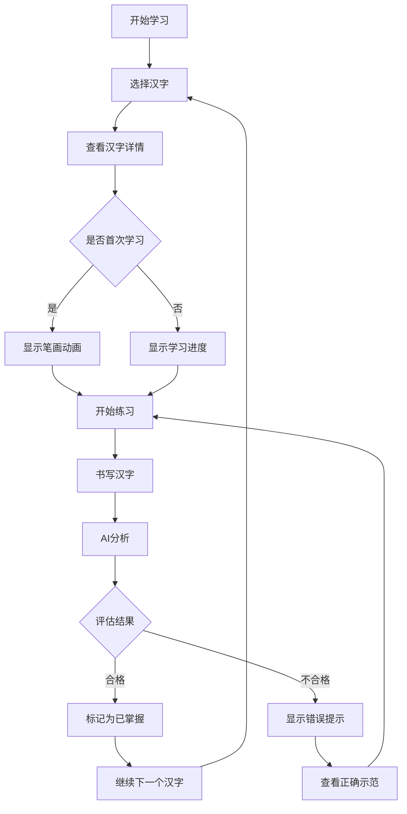
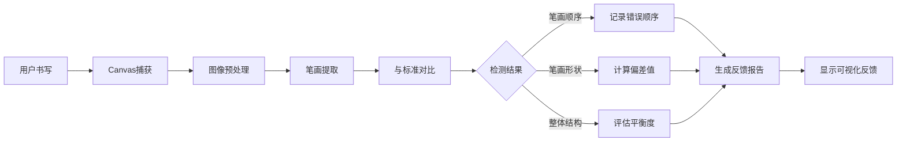
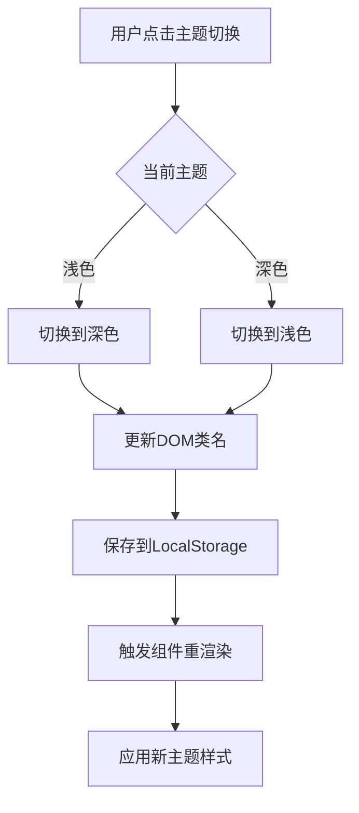

# HanziMaster 汉字大师产品需求文档 (PRD)
=====================================

## 1. 产品概述

HanziMaster 汉字大师是一个现代化的、基于人工智能的汉字学习平台。它利用先进的AI技术提供关于笔画顺序、平衡和美感的个性化反馈，帮助用户高效学习汉字。

### 1.1 产品定位
- **核心价值**: 结合传统汉字学习方法与现代AI技术，提供个性化、智能化的学习体验
- **目标市场**: 中文学习者、汉字书写练习者、汉字文化爱好者
- **竞争差异**: AI驱动的实时反馈、多语言支持、响应式设计

### 1.2 目标用户画像

| 用户类型 | 特征描述 | 核心需求 |
|---------|---------|---------|
| 初学者 | 零基础或刚开始学习汉字 | 基础笔画学习、入门引导、趣味性 |
| 中级学习者 | 有一定基础，需要提升 | 系统化练习、进度追踪、难点突破 |
| 高级学习者 | 希望精进书法水平 | 深度分析、个性化反馈、美学提升 |
| 文化爱好者 | 对汉字历史感兴趣 | 词源讲解、文化背景、历史故事 |

### 1.3 核心价值主张

1. **智能化学习**: AI驱动的实时反馈，让学习更高效
2. **个性化路径**: 自适应学习系统，根据进度调整内容
3. **文化传承**: 探索汉字背后的历史与文化
4. **无障碍设计**: 多语言支持，全球用户友好

## 2. 核心功能模块

### 2.1 用户角色定义

| 角色 | 注册方式 | 核心权限 | 数据存储 |
|------|---------|---------|---------|
| 访客 | 无需注册 | 浏览首页、了解功能 | 无 |
| 注册用户 | 邮箱/第三方登录 | 使用全部功能、查看进度 | LocalStorage |

### 2.2 功能模块架构

```
HanziMaster 功能模块
├── 首页模块
│   ├── Hero展示区
│   ├── 功能特性介绍
│   └── 导航入口
├── 学习模块 (/learn)
│   ├── 汉字选择器
│   ├── 汉字详情展示
│   ├── 学习进度追踪
│   └── AI反馈系统
├── 练习模块 (/practice)
│   ├── 手写输入区
│   ├── 笔画实时分析
│   ├── 评分系统
│   └── 错误纠正
├── 用户设置
│   ├── 主题切换
│   ├── 语言切换
│   └── 用户偏好设置
└── AI分析服务
    ├── 笔画顺序检测
    ├── 平衡性评估
    └── 美学评分
```

### 2.3 核心页面清单

| 序号 | 页面名称 | 路由路径 | 功能描述 | 优先级 |
|------|---------|---------|---------|-------|
| 1 | 首页 | / | 应用介绍、功能展示、导航入口 | P0 |
| 2 | 学习页 | /learn | 汉字选择、学习详情、AI洞察 | P0 |
| 3 | 练习页 | /practice | 手写练习、实时反馈、进度追踪 | P0 |
| 4 | 设置页 | /settings | 主题、语言、偏好设置 | P1 |

### 2.4 功能详细描述

#### 2.4.1 首页功能

| 模块 | 功能点 | 描述 | 状态 |
|------|--------|------|------|
| Hero区域 | 应用标语 | 展示"汉字大师"核心价值 | 已实现 |
| Hero区域 | 功能引导 | 强调AI驱动的个性化学习 | 已实现 |
| Hero区域 | 示例汉字展示 | 展示"永"字及基本信息 | 已实现 |
| 特性介绍 | AI洞察卡片 | 展示AI反馈功能 | 已实现 |
| 特性介绍 | 词源文化卡片 | 展示历史文化功能 | 已实现 |
| 特性介绍 | 自适应学习卡片 | 展示个性化学习功能 | 已实现 |
| 导航入口 | 学习按钮 | 跳转到学习页面 | 已实现 |
| 导航入口 | 练习按钮 | 跳转到练习页面 | 已实现 |

#### 2.4.2 学习模块

| 功能点 | 描述 | 技术实现 | 状态 |
|--------|------|---------|------|
| 汉字浏览 | 展示汉字列表 | Grid布局组件 | 待实现 |
| 汉字搜索 | 按拼音或字形搜索 | 搜索过滤算法 | 待实现 |
| 汉字详情 | 显示笔画数、结构、拼音 | 详情卡片组件 | 待实现 |
| 学习追踪 | 记录学习历史 | LocalStorage持久化 | 待实现 |
| AI洞察 | 显示AI分析结果 | Gemini API集成 | 待实现 |

#### 2.4.3 练习模块

| 功能点 | 描述 | 技术实现 | 状态 |
|--------|------|---------|------|
| 手写输入 | Canvas绘制汉字 | HTML5 Canvas | 待实现 |
| 笔画识别 | 识别用户输入 | 图像处理算法 | 待实现 |
| 实时反馈 | 即时显示正误 | AI分析引擎 | 待实现 |
| 评分系统 | 0-100分评分 | 评估算法 | 待实现 |
| 错误高亮 | 标出不正确的笔画 | 可视化标注 | 待实现 |

#### 2.4.4 AI分析服务

| 分析维度 | 评估内容 | 反馈形式 | 权重 |
|---------|---------|---------|-----|
| 笔画顺序 | 笔画是否按正确顺序书写 | 文字说明 + 动画 | 40% |
| 笔画平衡 | 整体结构是否平衡匀称 | 评分 + 建议 | 30% |
| 美学评估 | 整体美观程度 | 评分 + 改进建议 | 30% |

## 3. 核心业务流程

### 3.1 用户学习流程



### 3.2 AI反馈流程



### 3.3 主题切换流程



## 4. 用户界面设计

### 4.1 设计风格指南

#### 4.1.1 色彩系统

| 色彩角色 | 浅色模式 | 深色模式 | 使用场景 |
|---------|---------|---------|---------|
| 主色调 | Emerald-600 (#059669) | Emerald-400 (#34d399) | 主要按钮、链接、重点元素 |
| 背景色 | Slate-50 (#f8fafc) | Slate-900 (#0f172a) | 页面背景 |
| 卡片背景 | White (#ffffff) | Slate-800 (#1e293b) | 卡片、面板 |
| 文本主色 | Slate-900 (#0f172a) | White (#ffffff) | 主要文字 |
| 文本次色 | Slate-600 (#475569) | Slate-300 (#cbd5e1) | 次要文字 |
| 边框色 | Slate-200 (#e2e8f0) | Slate-700 (#334155) | 分隔线、边框 |

#### 4.1.2 字体系统

| 字体用途 | 字体名称 | 字重 | 字号范围 |
|---------|---------|------|---------|
| 界面字体 | Inter | 400-700 | 12px-72px |
| 代码字体 | JetBrains Mono | 400-500 | 12px-16px |
| 汉字显示 | Noto Sans SC | 400-700 | 24px-144px |
| 英文辅助 | Inter | 400-500 | 14px-18px |

#### 4.1.3 圆角系统

| 元素类型 | 圆角值 | 使用场景 |
|---------|--------|---------|
| 按钮 | 0.75rem (12px) | 主要按钮 |
| 卡片 | 1.5rem (24px) | 功能卡片 |
| 大卡片 | 3rem (48px) | 主展示卡片 |
| 输入框 | 0.5rem (8px) | 输入字段 |

#### 4.1.4 阴影系统

| 阴影级别 | CSS值 | 使用场景 |
|---------|-------|---------|
| 小阴影 | shadow-sm | 轻微抬升 |
| 中阴影 | shadow-md | 卡片默认 |
| 大阴影 | shadow-2xl | 浮层、模态框 |
| 强调阴影 | shadow-lg shadow-emerald-xxx | 主要操作按钮 |

### 4.2 页面设计规范

#### 4.2.1 首页设计

| 模块 | 布局 | 尺寸 | 响应式策略 |
|------|------|------|-----------|
| Header | 固定顶部，水平导航 | 高度64px | 保持不变 |
| Hero区域 | 左右分栏（桌面）/ 垂直堆叠（移动） | 最大宽度1280px | 断点768px |
| 特性卡片 | 三列网格 | 间距32px | 断点768px改为单列 |
| Footer | 居中单行 | 内边距32px | 保持不变 |

**动画效果**:
- Hero区域卡片: `transform: rotate(-2deg)`, hover时`rotate(0deg)`, 过渡时间500ms
- 特性卡片: hover时`scale(1.05)`, 过渡时间300ms
- 背景装饰: 绝对定位，使用`rotate(3deg)`倾斜

#### 4.2.2 学习页设计

| 模块 | 布局 | 功能描述 |
|------|------|---------|
| 汉字网格 | 响应式网格，4-6列 | 显示可学习的汉字 |
| 汉字卡片 | 包含字形、拼音、笔画数 | 点击查看详情 |
| 详情面板 | 侧滑或模态框 | 显示完整信息 |
| 进度条 | 顶部或侧边栏 | 显示学习进度 |

**交互规范**:
- 卡片hover: `scale(1.02)`, `box-shadow`增强
- 选中状态: 边框高亮（主色调）
- 加载状态: 骨架屏动画

#### 4.2.3 练习页设计

| 模块 | 布局 | 功能描述 |
|------|------|---------|
| Canvas区域 | 正方形，居中 | 手写输入区 |
| 参考字 | Canvas上方或叠加 | 显示目标字形 |
| 反馈面板 | 右侧或下方 | 显示AI分析结果 |
| 操作按钮 | 底部固定栏 | 提交、重置、下一个 |

**Canvas规范**:
- 默认尺寸: 400x400px
- 画笔颜色: 根据主题变化
- 线宽: 3-5px
- 支持触摸和鼠标输入

### 4.3 响应式设计规范

#### 4.3.1 断点定义

| 断点名称 | 最小宽度 | 最大宽度 | 目标设备 |
|---------|---------|---------|---------|
| sm | 640px | - | 大手机 |
| md | 768px | - | 平板 |
| lg | 1024px | - | 小笔记本 |
| xl | 1280px | - | 桌面显示器 |
| 2xl | 1536px | - | 大屏显示器 |

#### 4.3.2 响应式策略

| 页面 | 桌面布局 | 平板布局 | 移动布局 |
|------|---------|---------|---------|
| 首页 | 双列Hero + 三列特性 | 双列Hero + 双列特性 | 单列堆叠 |
| 学习页 | 侧边栏详情 + 主区域网格 | 模态详情 + 主区域网格 | 全屏列表 |
| 练习页 | 左右布局（Canvas + 反馈） | 上下布局 | 简化布局 |

### 4.4 组件设计规范

#### 4.4.1 按钮组件

```typescript
// 按钮变体
type ButtonVariant = 'primary' | 'secondary' | 'outline' | 'ghost';

// 尺寸
type ButtonSize = 'sm' | 'md' | 'lg';

// 状态
type ButtonState = 'default' | 'hover' | 'active' | 'disabled' | 'loading';
```

| 变体 | 背景色 | 边框 | 文字色 | 使用场景 |
|------|-------|------|-------|---------|
| Primary | Emerald-600 | 无 | White | 主要操作 |
| Secondary | Slate-100 | 无 | Slate-900 | 次要操作 |
| Outline | Transparent | Slate-200 | Slate-900 | 辅助操作 |
| Ghost | Transparent | 无 | Slate-600 | 文字按钮 |

#### 4.4.2 卡片组件

```typescript
interface CardProps {
  variant: 'default' | 'elevated' | 'outlined';
  padding: 'sm' | 'md' | 'lg';
  interactive: boolean;
}
```

| 属性 | 默认值 | 说明 |
|------|--------|------|
| variant | default | 卡片样式变体 |
| padding | md | 内边距大小 |
| interactive | false | 是否支持交互 |

#### 4.4.3 输入组件

| 类型 | 样式 | 状态 | 反馈 |
|------|------|------|------|
| 文本输入 | 圆角8px, 边框1px | focus: 边框变主色 | 错误提示红色 |
| 搜索框 | 带图标，圆角全 | focus: 阴影增强 | 实时搜索建议 |
| Canvas | 虚线边框，浅色背景 | 绘制时显示笔迹 | AI反馈高亮 |

## 5. 数据模型设计

### 5.1 汉字数据模型

```typescript
interface Hanzi {
  character: string;           // 汉字字符
  pinyin: string;               // 拼音发音
  meaning: string;              // 基本含义
  strokeCount: number;          // 笔画数
  radical: string;             // 部首
  structure: '独体' | '左右' | '上下' | '包围' | '半包围'; // 结构类型
  strokeOrder: string[];        // 笔画顺序
  etymology?: string;           // 词源故事
  difficulty: 1 | 2 | 3;        // 难度等级
}
```

### 5.2 用户进度模型

```typescript
interface UserProgress {
  odCharacter: string;         // 汉字字符
  odlearnedAt: string;          // 学习时间
  odpracticeCount: number;     // 练习次数
  odaverageScore: number;       // 平均得分
  odmasteryLevel: 'new' | 'learning' | 'reviewing' | 'mastered'; // 掌握程度
  odlastPracticedAt?: string;  // 最后练习时间
}
```

### 5.3 练习记录模型

```typescript
interface PracticeRecord {
  id: string;                   // 记录ID
  character: string;            // 汉字字符
  odrawStrokes: string;         // 原始笔画数据
  odscore: number;              // 总分
  odstrokeOrderScore: number;   // 笔画顺序得分
  odbalanceScore: number;       // 平衡性得分
  odaestheticsScore: number;    // 美学得分
  odfeedback: string;           // AI反馈文本
  odcreatedAt: string;         // 创建时间
}
```

## 6. API集成规范

### 6.1 Google Gemini API

| 功能 | 端点 | 请求格式 | 响应格式 |
|------|------|---------|---------|
| 笔画分析 | Gemini Pro Vision | 图片 + 提示词 | JSON分析结果 |
| 反馈生成 | Gemini Pro | 文本提示词 | 自然语言反馈 |

### 6.2 环境变量

```bash
GEMINI_API_KEY=your-api-key-here  # Google Gemini API密钥
```

### 6.3 API调用规范

```typescript
// 请求频率限制
const RATE_LIMIT = {
  maxRequests: 10,
  perMinutes: 60
};

// 错误处理
interface APIError {
  code: string;
  message: string;
  retryable: boolean;
}
```

## 7. 性能优化目标

| 指标 | 目标值 | 测量方法 |
|------|--------|---------|
| 首屏加载时间 | < 2s | Lighthouse |
| 交互响应时间 | < 100ms | User Timing API |
| Lighthouse评分 | > 90 | Lighthouse |
| 包体积 | < 200KB (首屏) | Bundle Analyzer |

## 8. 可访问性要求

| 要求 | 标准 | 实现方式 |
|------|------|---------|
| 颜色对比度 | WCAG AA (4.5:1) | Tailwind dark模式 |
| 键盘导航 | 完整支持 | Tab index, focus状态 |
| 屏幕阅读器 | 语义化HTML | ARIA标签 |
| 触摸优化 | 最小点击区域44px | 移动端适配 |

## 9. 未来功能规划

### 9.1 Phase 2 (v2.3.0 - v2.5.0)
- [ ] 用户账户系统
- [ ] 云端进度同步
- [ ] 汉字词汇学习
- [ ] 学习成就系统

### 9.2 Phase 3 (v3.0.0)
- [ ] 社区功能
- [ ] 在线对战
- [ ] 高级书法课程
- [ ] AI私人教师

## 10. 文档关联

- [技术架构](02-architecture.md) - 系统架构设计
- [开发指南](03-development.md) - 开发环境配置
- [API 参考](04-api-reference.md) - 详细API文档
- [部署指南](05-deployment.md) - 部署流程
- [测试规范](06-testing.md) - 测试策略

---

**文档版本**: v2.2.1
**最后更新**: 2026-05-31
**维护者**: HanziMaster Team
